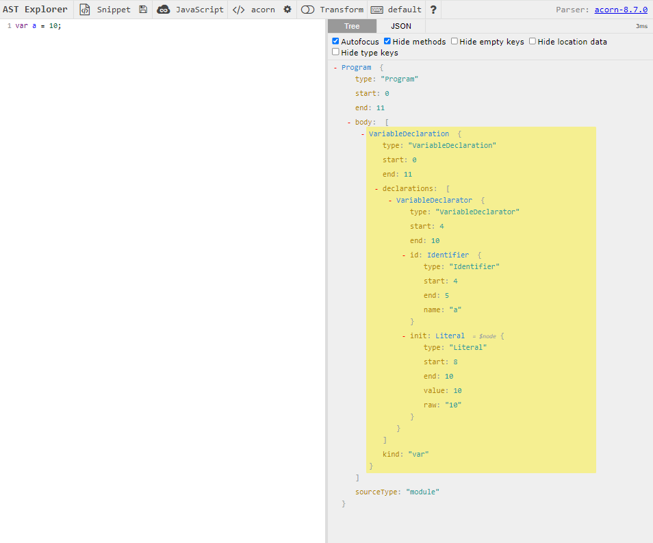
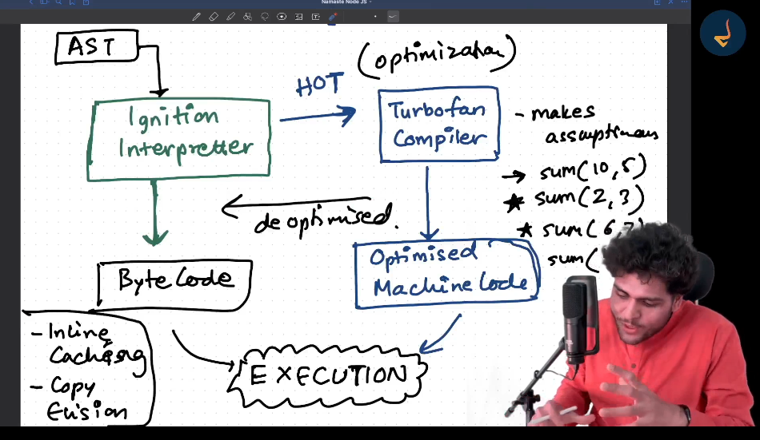
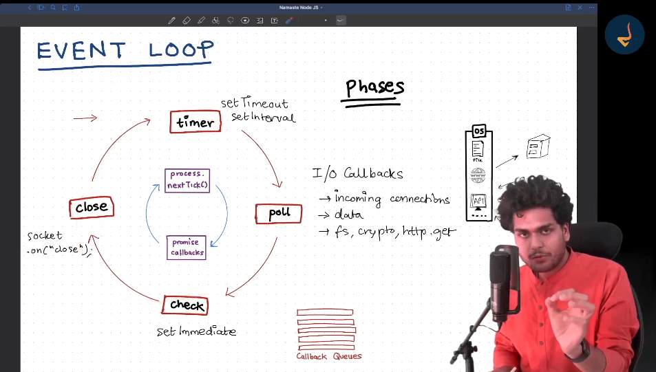
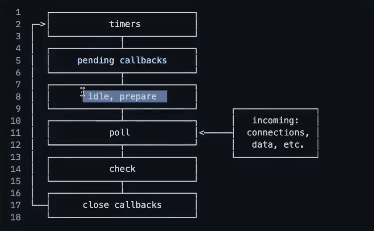

# Modules

- Modules are a collection of code that is private to itself.
- Modules protects their variables and functions from leaking.
- we need to explicitly mention the methods and variables that we want export.
- module.exports = {
  x,
  sum,
  };
  is similar to
  module.exports = {
  x:x,
  sum:sum,
  };

- module.exports initially is an empty object
- we can also export using module.exports.x = x, module.exports.sum = sum;
- when require("./path") is used, all of the code is wrapped inside a function(IIFE)
- IIFE - Immediately invoked function expression.
- example of IIFE
- (function(){
  // ALL the code of the module runs inside here
  })()
  - IIFE invokes the function immediately
  - provides privacy to variables to methods
  - so the reason for variables and methods private in different modules is because of IIFE and require statement.
- How do you get access to mode.exports, require?
- Nodejs passes modules, require and also other as a parameter to the IIFE
- (function(exports, require,module, **filename, **dirname){
  // ALL the code of the module runs inside here
  })(module, require, ...rest)
- this IIFE along with params passed by nodejs is what is passed to js engine

# Five step mechanism happens when require("/path") is used

- Resolving the module
  - checking whether it is a local path etc.
  - checking whether it is json file of node:module etc or a created private module.
- Loading the module
  - file content is loaded according file type
- wraps inside an IIFE (compile step )
- Code Evaluation
  - module.exports is returned from the require statement
- Caching
  - module is cached

# Nodejs has an event-driven architecture capable of asynchronous I/O

- Javascript is a synchronous single threaded language
- Meaning there is only one thread in which js engine runs (single threaded)
- Thread is a smallest unit of execution in a process
- Javascript is single threaded meaning executes line by line
- Javascript is synchronous but with Nodejs we can perform asynchronous tasks.
- Asynchronous tasks are tasks that takes time.
- js engine offloads the requirements like accessing timer, databases, network calls and file system to libuv and libuv inteacts with os that manages all these and gets access to the resources and does the task and passes to JS Engine.
- js engine can get access to all these super powers through libuv.
- libuv is a multi-platform C library that provides support for asynchronous I/O based on event loops.
- libuv acts a middle-layer between v8 engine and operating system.
- That is why NodeJs is asynchronous and can do asynchronous I/O and non-blocking I/O as doesnot block the main thread JS ENGINE.
- Javascript is synchronous singlethreaded but nodejs has libuv through which asynchronous I/O can be performed.
- libuv is a famous library used in other places as well as where we need I/O operations to handle.

# require require("node:util") is same as require("util")

# diving deep into v8 engine

- Developed and maintained by google.
- V8 engine parses, interprets, compiles and executes Javascript code.
- when the code goes through v8 engine, the following steps happen
- Parsing:
  - lexical analysis (also known as tokenization): code that we provide is broken down into tokens
  - syntax analysis: an abstract syntax tree(AST) is developed from the tokens.
  - Example of AST:-
  - 
  - when the code was not able to generate an abstract syntax tree, we face syntax error.
- There are two types of languages, interpretted and compiled.
- In interpretter, the code is translated line by line at the time of excution.
- In Compiler, the code is first compiled to machine code so that during execution, no translation is required.
- interpretted languages have fast initial execution but compiled languages initially heavily but executed.
- interpretted languages are slow, although compiled languages takes time initially they are faster later.
- Javascript is just in time compilation language. it has compiler as well as interpretter.
- After Ast is formed, it goes to interpretter.
- v8 engines interpretter name is ignition.
- interpretter converts the code to byte code and after that the code goes through execution.
- v8 engines compiler is turbo fan.
- when the code is being processed in interpretter it finds out the code which is used again and again. this reusabled code is called hot code, this code is passed to compiler so that it could optimize in such a way that the execution of that hot code would be faster.
- compiler compiles the hot code and generates an optimised machine code.
- The role of the compiler is to optimise the hot code so that it's execution would be faster.
- but while converting to optimised machine code it makes some assumptions.
- like if the hot code is a sum function that takes 2 parameters a and b, lets say it assumes that a and b are numbers.
- if in future a sum call is invoked with two strings then it deoptimises the code and passes it to interpretter, it interpretts and converts into byte code.
- 
- the use of interpretter and a compiler to convert the ast into byte and optimised machine code is called just in time compilation.
- Also garbage collection is done in parallel, v8's garbage collection are called orinoco, oil pan, scavenger
- mark and sweep algorithm is used for garbage collection.
- v8 engine also does inline caching, copy elision

# libuv deep dive

- lib uv consists of event loop, callback queues, thread pool.
- when v8 engine encounters an asynchronous task it will offload it to libuv.
- after the completion of the asynchronous tasks, it is libuv's job to pass the call back functions to the call stack for execution.
- the call functions are pushed to the call back queue and once the call stack is empty then the tasks in the callback queue are pushed to the call stack.
- event loop is the one which monitors the call stack and the callback queue and once the call stack is empty then the tasks are pushed to callstack.
- there's one callback queue for settimeout, one for polling apis and many other call back queues.
- if there are multiple sorts of callback functions are present in the callback queues then which callback function should be given priority.
- event loop runs in phases. kind of a circular loop
  - 
  - first phase is timer phase where all the settimeout, setinterval callbacks are executed.
  - next phase is poll phase where all the I/O callbacks like incoming connections, fs, crypto, http.get are executed.
  - next is check phase where setImmediate callback functions are executed.
  - next is close phase, socket.on("close")etc call back functions are executed.
  - next would be timer phase and the loop continues.
- and before each of these phases running there is some another circular loop which is run initially
  - process.nextTick() phase where it checks if there are any callbacks from process.nextTicks
  - promise callbacks phase where it checks if there are callbacks from the resolved promises.
  - after these two checks then it goes to the timer/poll/check/close phases.
  - these nexttick and promise.callback are always checked before the timer and poll and check and close phases.
- # when the event loop has nothing to do, meaning both the call stack and the call back queues are empty, then the event loops waits in the pool phase
- along with timer, poll,close, check there are some other phases as well (pending callbacks, idle/prepare phase).
- 
- one tick is known as one cycle in event loop.
- all the pending I/O call backs in the poll phase or the I/O callbacks that were deferred gets executed in pending callbacks phase.
- pending callbacks phase:- executes I/O callbacks deferred to the next loop iteration.
- idle, prepare:- only used internally (we as developer don't need to take care of this, these are checks done by nodejs)
- # Thread Pool
  - asynchronous operations like fs.readFile are offloaded by the v8 engine to the libuv.
  - libuv has a thread pool, it finds a thread from the thread pool and runs the file access system on that thread.
  - libuv uses one of the thread from the thread pool and performs the operations on that thread.
  - thread is a container where we can execute code.
  - size of the thread pool is 4 by default.
  - UV_THREADPOOL_SIZE = 4
  - thread pools are used when we do some fs calls, dns.lookup, crypto calls or some user specified input.
  - # Is Node Js is single threaded or multi-threaded.
    - It depends when the code provided is synchronous code then it is single threaded.
    - but when it has some operations that are asynchronous which requires a thread from the threadpool to execute then it is multi-threaded.
    - It depends on the code we are running in the nodejs
- we can change the size of the thread pool using process.env.UV_THREADPOOL_SIZE
- all the networking in server happens on sockets.
- each socket has a socket descriptor
- if there are multiple users making api requests then the threads are not used from thread pool.
- for handling multiple requests from users, os uses epoll(linux) or kqueue algorithms.
- these algos are called scalable I/O event notification mechanisms
- epoll descriptor is a collection of socket descriptors.
- one epoll descriptor can handle multiple connections.
- epoll is implemented at the kernel level of the operating system, it handles multiple socket descriptors.
- if there are any activity on any of the socket, epoll descriptor will notify it to the libuv.
- in the poll phase, event loop sends the callback to the callstack
- epoll is a system call for scalable I/O event notification mechanism.

# Server

- Server word is loosely used, sometimes used for hardware, software or an application.
- Deploying application on a server means a hardware, physical machine on which we will be running our application.
- example:- our website is hosted on AWS servers meaning we are using the hardware provided by the AWS to run the application. here server is referring to hardware. here hardware is referred to as server.
- sometimes server word is referred for software, we are creating http server using nodejs meaning creating a server that handles requests. here application is referred to as server.

# Client Server Architecture

- client is someone that is acessing the server, the one that is sending the requests.
- when client makes a request, a socket connection is made and after that the request is sent to the server, server handles the request and sends the response back to the client and after that the socket is closed.
- for every connection a new socket is created and after the response the socket is closed.
- when a socket connection is made, it uses TCP/IP protocol.
- protocol basically means the rules required for the communication.
- HTTP, FTP, SMTP protocols basically say how the data should be sent in the network.
- when we visit a website, user sends a HTTP request and server responds with HTML,JS, JSON data etc.
- SMTP is used for email sending and forwarding
- FTP is used for file transfer
- These protocols says how the data should be sent and recieved over the network. each protocol is used for specific type of communication.
- nodejs is mostly used for creating web servers, HTTP servers
- we can have multiple applications on the same server, inorder to identify where exactly the application is running in the server we use ports.

# Socket vs WebSockets

- in sockets, the socket connection gets removed after the response.
- in websockets, we have this connection until we explicitly close, we make a two way connection and we can send data in either way.
- generally, we make api calls we use sockets and the socket gets closed once the request gets completed.

# Express Js

- creating HTTP servers using HTTP module is not the best way thus we use a wrapper around nodejs called express js to create HTTP servers.
- express js is a nodejs web application framework
- we will be using express for handling http requests from now on.
